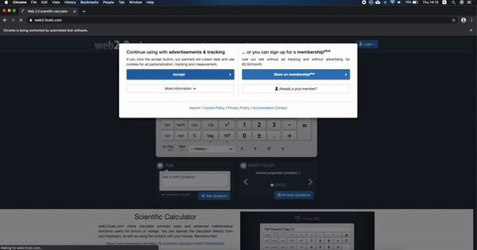

# Calculator Assignment

## About the project
* This is Maven project which has pom.xml file includes dependencies.
* Used dependencies: Selenium, TestNG, Log4J, Cucumber and ExtentReports.
---
## Project Structure
### resources dir
##### Contains:
* Chrome driver executable file for running local browser, if driver file isn't supported you can download compatible driver version from [here](https://chromedriver.chromium.org/downloads).
* Properties file, contains parameters and values used in the script.
### src main java com
* This package has java utility classes used for testing.
### src main java pom
* This package has the calculator page object.
### src main resources
* This directory has log4J configurations file for logging script steps. test-output folder will be created on running the tests.
### src test
* This package has Cucumber features directory.
### src test java
* This package has definitions classes, test launcher class and TestNGRunner.xml to run the test as TestNG.
### src test resources
* This directory has ExtentReport configurations files for logging script steps as HTML report. log folder will be created on running the tests.
### features
* This directory has 2 feature files (CalculatorScenario & CalculatorScenario2) with 2 different writing styles, defined feature file for the assignment is CalculatorScenario.
* CalculatorScenario2 written in case we need to test each button in the page.
### target dir
* Is generated by Maven.
* Open cucumber dir to find the test report (CalculatorScenario.html).
* Open surefire-reports to find TestNG generated reports.
### test-output dir
* Is generated by ExtentReport.
* Open ExtentHtml.html file to get Logs.
---
## How to run the test suite?
* As TestNG: find TestNGRunner.xml under test package, right click on the file then select run or run as TestNG.
* Maven: mvn -Dmaven.test.failure.ignore=true test
---
##### Supported browsers and environments:
| Browser        | ENV            |
| ---------------|:--------------:|
|Chrome          |MAC             |

# Video

